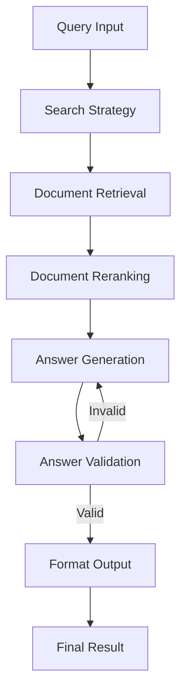

# LangGraph RAG System

LangGraph를 사용한 고급 RAG (Retrieval-Augmented Generation) 시스템입니다.

## 주요 기능

### 기본 RAG 시스템 (`rag_graph.py`)
- 문서 임베딩 및 벡터 저장소 관리
- 유사도 기반 문서 검색
- LLM을 통한 답변 생성
- 대화 히스토리 관리

### 고급 RAG 시스템 (`advanced_rag_graph.py`)
- **다중 검색 전략**: Similarity, MMR, Hybrid 검색 지원
- **문서 재순위화**: LLM 기반 관련성 점수 계산
- **답변 검증**: 생성된 답변의 품질 자동 검증
- **메타데이터 필터링**: 파일 타입, 날짜 등으로 검색 범위 제한
- **조건부 워크플로우**: 답변 품질에 따른 재생성

## 설치 방법

1. 필요한 패키지 설치:
```bash
pip install -r requirements.txt
```

2. 환경 변수 설정:
```bash
cp .env.example .env
# .env 파일을 열어 OPENAI_API_KEY 설정
```

## 사용 방법

### 기본 사용법

```python
from rag_graph import RAGGraph

# RAG 시스템 초기화
rag = RAGGraph()

# 문서 추가
rag.add_documents(["document1.pdf", "document2.txt"])

# 질문하기
result = rag.query("문서의 주요 내용은 무엇인가요?")
print(result['answer'])
```

### 고급 사용법

```python
from advanced_rag_graph import AdvancedRAGGraph

# 고급 RAG 시스템 초기화
rag = AdvancedRAGGraph()

# 디렉토리에서 문서 일괄 추가
rag.add_documents_from_directory("./documents", glob_pattern="**/*.txt")

# 다양한 검색 전략 사용
result = rag.query_with_metadata(
    question="다양한 기술들을 소개해주세요",
    search_type="mmr",  # Maximum Marginal Relevance
    metadata_filter={"file_type": ".txt"}
)
```

## 예제 실행

### 기본 예제
```bash
python example.py
```

### 고급 예제
```bash
python advanced_example.py
```

## 아키텍처

### LangGraph 워크플로우



### 주요 컴포넌트

1. **State Management**: TypedDict를 사용한 상태 관리
2. **Vector Store**: Chroma DB를 사용한 벡터 저장소
3. **Embeddings**: OpenAI Embeddings
4. **LLM**: GPT-4 Turbo (답변 생성), GPT-3.5 Turbo (재순위화)

## 검색 전략

### Similarity Search
- 기본 코사인 유사도 기반 검색
- 가장 빠르고 일반적인 방법

### MMR (Maximum Marginal Relevance)
- 다양성을 고려한 검색
- 중복되지 않는 다양한 정보 제공

### Hybrid Search
- 키워드 검색과 의미 검색 결합
- 정확도와 재현율의 균형

## 파일 구조

```
rag-langgraph/
├── rag_graph.py           # 기본 RAG 시스템
├── advanced_rag_graph.py  # 고급 RAG 시스템
├── example.py             # 기본 사용 예제
├── advanced_example.py    # 고급 사용 예제
├── requirements.txt       # 필요 패키지
├── .env.example          # 환경 변수 예제
└── README.md             # 이 파일
```

## 주의사항

- OpenAI API 키가 필요합니다
- 대용량 문서 처리 시 API 비용이 발생할 수 있습니다
- 벡터 저장소는 로컬에 저장되며, 필요시 초기화할 수 있습니다

## 문제 해결

### API 키 오류
```bash
export OPENAI_API_KEY="your-api-key-here"
# 또는 .env 파일에 설정
```

### 메모리 부족
- `chunk_size`를 줄여서 문서 분할 크기 조정
- 배치 처리로 대용량 문서 처리

### 검색 성능 개선
- 적절한 검색 전략 선택
- 메타데이터 필터링 활용
- 재순위화 임계값 조정

## 라이선스

MIT License
